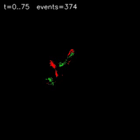

# Gesture Recognition

Event-vision gesture recognition experiments, data tooling, and visualization scripts.

## Highest-SNR Event Stream

The GIF below is generated from the current highest-ranked stream by the SNR sorter (`65536_A_19_10s.bin` at the time of generation).

This helps illustrate the data sensing and collection process. WIP

## Relevant Scripts

- `transfer_raw_event_streams.py`: move new raw event streams into `gesture_data/raw_event_streams` and visualize them
- `event_visualizer.py`: build per-stream heatmaps and MP4 visualizations
- `snr_sort_event_frames.py`: estimate per-stream SNR and create an SNR-ranked stitched MP4
